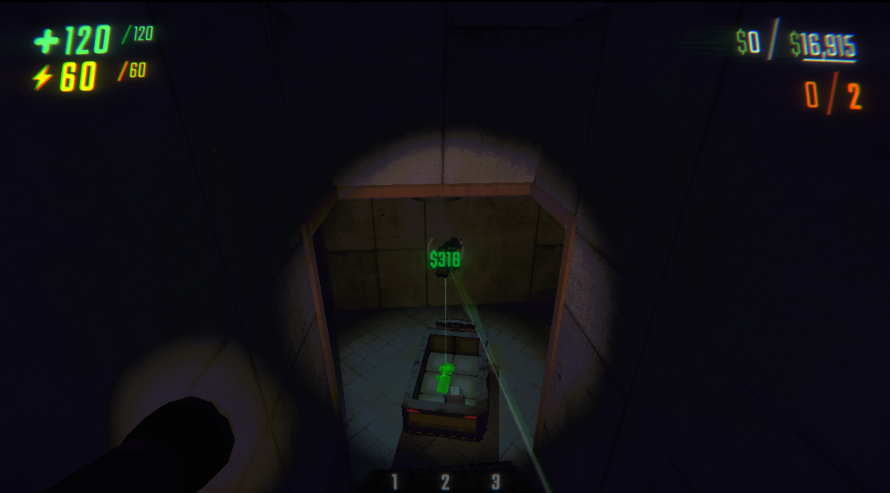
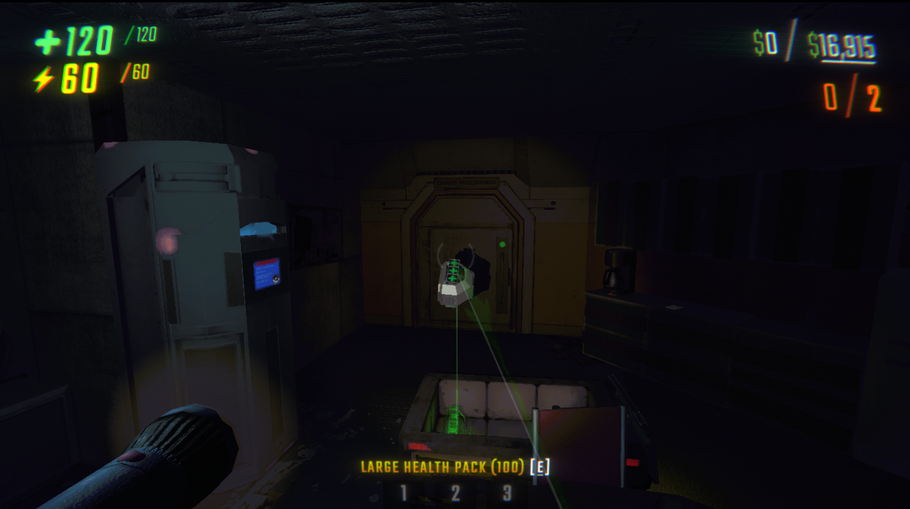
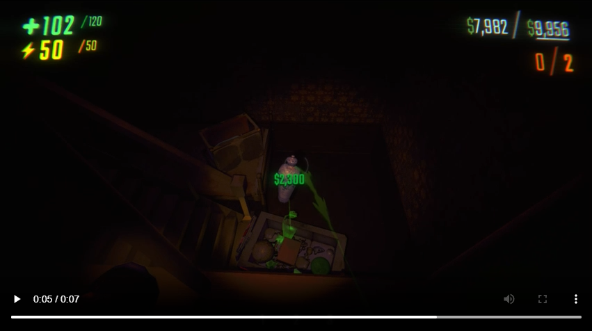

# REPO-DropLaser-PrecisionMod

A precise object landing assistant for the game **REPO**.  
**Adds a customizable laser showing where your held object will land if dropped**, helping you aim throws and drops more accurately.

---

## Features

- Adds a **downward-pointing laser** from your grabbed objects.
- Helps visually predict **where objects will land** when dropped.
- Optional **ghost landing preview** with modes:
  - `Never`
  - `Only on cart`
  - `Always`
- **Customizable colors**: match your beam color or define your own.
- **Fully configurable** beam width, brightness, and range.
- **Ghost preview tuning**: color, opacity, emission intensity, and update interval.
- **Auto-activation** option: laser turns on automatically when grabbing an object.
- **Config migration support** keeps prior settings on newer plugin schema versions.
- **Multiplayer compatible**: laser is shown only for your local player.
- **Efficiently optimized** for minimal performance impact.

---

## Screenshots & Video

*Note: The green grab beam is from my other mod, [DynamicRepoGrabBeam](https://thunderstore.io/c/repo/p/REPOWorkshop/DynamicRepoGrabBeam/).*

---

## Installation

1. Install [BepInEx](https://github.com/BepInEx/BepInEx) for REPO if you haven't already.
2. Download the latest release `.zip` from this repository or Thunderstore page.
3. Extract the `.dll` file into your `BepInEx/plugins/` folder.
4. Launch REPO.
5. The landing laser system will now be available when grabbing objects.

---

## Configuration

The mod automatically generates a config file at: `REPO\BepInEx\config`

You can customize:

- **Master Enable**: Fully disable or enable the system.
- **Laser Toggle Key**: Default is `L`, but you can assign any key.
- **Beam Colors**:
  - Use your grab beam's color automatically.
  - Or override with a custom static color.
- **Laser Shape**:
  - Start and end widths.
  - Laser max downward scan distance.
- **Laser Light**:
  - Glow brightness (intensity).
  - Glow range.
- **Ghost Preview**:
  - Enable mode (never/on-cart/always).
  - Use laser color or set a custom ghost color.
  - Opacity and emission intensity.
  - Update frame interval (performance vs smoothness).
- **Auto-Enable**:
  - Automatically turns the laser on when grabbing an object if you want.

---

## How It Works

- **Dynamic Laser Control**:  
  Laser only appears when you're holding something and can be toggled freely.

- **Precision Raycasting**:  
  The laser scans downward, ignoring invisible cart barriers and non-physical triggers to accurately hit solid ground or surfaces.

- **Singleplayer and Multiplayer Handling**:  
  In multiplayer, lasers are local to each client and don't interfere across players.

- **Auto Cleanup**:  
  On scene changes, lasers are properly destroyed and reset to prevent duplication or errors.

---

## Credits

- Developed by **M1llerF**  

---

## License

This mod is released under the [MIT License](LICENSE).  
You are free to modify, distribute, and expand upon it with appropriate attribution.

---

